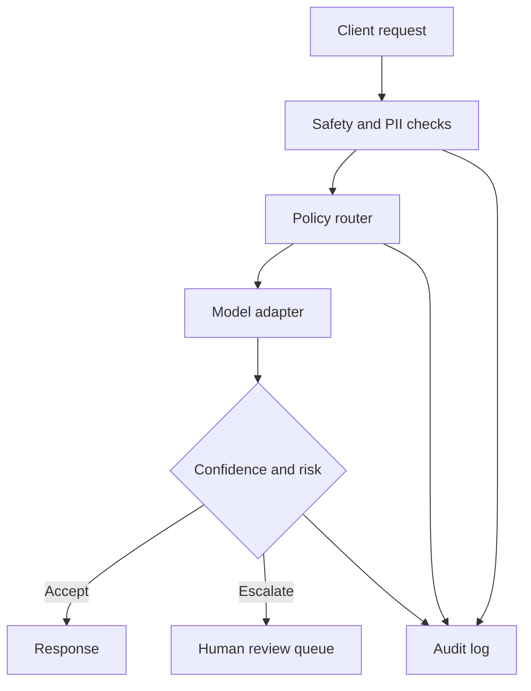

# Responsible AI Orchestration Gateway

A small, runnable work sample showing how I approach production AI-platform problems: route requests, protect sensitive data, escalate uncertain outputs to human review, and retain an auditable event trail.

This repository is an original, sanitized demonstration. It contains no employer source code, customer data, or proprietary implementation details.

## What it demonstrates

- policy-based model routing by task, latency target, and risk
- prompt moderation and PII redaction before inference
- confidence-based human-review escalation
- structured audit events for governance and debugging
- health, metrics, inference, review, and audit APIs
- deterministic unit tests with only the Python standard library

## Architecture



The demo uses a deterministic model adapter so it runs without API keys. In production, the adapter boundary would connect to hosted or self-managed models, and the in-memory stores would be replaced by durable streaming and database infrastructure.

## Run locally

```bash
python3 -m app.server
```

Then submit a request:

```bash
curl -s http://localhost:8080/v1/inference \
  -H 'Content-Type: application/json' \
  -d '{"prompt":"Summarize this account note for jane@example.com","task":"summarization","risk":"medium","latency_budget_ms":500}'
```

Useful endpoints:

| Endpoint | Purpose |
| --- | --- |
| `GET /health` | Liveness check |
| `GET /metrics` | Request and review counters |
| `POST /v1/inference` | Run the orchestration pipeline |
| `GET /v1/reviews` | Inspect pending human reviews |
| `POST /v1/reviews/{id}/resolve` | Resolve a review |
| `GET /v1/audit` | Inspect traceable platform events |

## Test

```bash
python3 -m unittest discover -s tests -v
```

## Design choices

1. **Separate policy from model execution.** Routing and governance rules can evolve without coupling them to a specific provider.
2. **Redact before inference.** Sensitive data should not reach a model unless explicitly allowed by policy.
3. **Make human review a first-class state.** Low-confidence or high-risk responses are queued with context instead of silently returned.
4. **Audit decisions, not raw secrets.** Events record why a decision occurred while avoiding persistence of the original unredacted prompt.
5. **Keep the demo reproducible.** The standard-library implementation and deterministic adapter make review simple and remove credential setup.

See [CASE_STUDY.md](CASE_STUDY.md) for the project narrative and [ARCHITECTURE.md](ARCHITECTURE.md) for production evolution.

